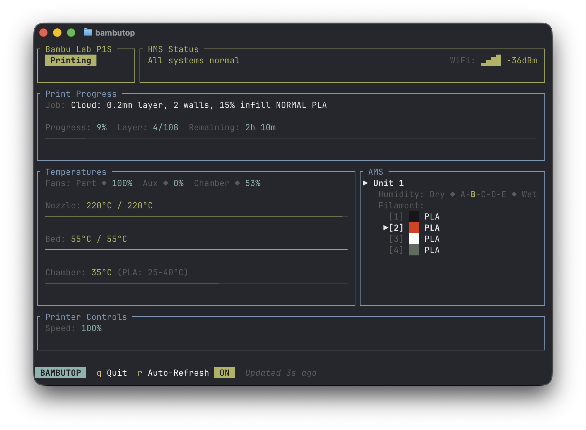

# BambuTop

[](https://www.gnu.org/licenses/gpl-3.0) [](https://github.com/rhoopr/bambutop/releases/latest)

A terminal-based status monitor for Bambu Lab printers. Think `htop`, but for your 3D printer.



## What You Can Monitor

- **Print Progress** — Job name, speed, layer count, and time remaining
- **Temperatures** — Nozzle, bed, and chamber with visual gauges
- **Fan Speeds** — Part cooling, auxiliary, and chamber fans
- **AMS Status** — Humidity levels and filament info for each slot
- **HMS Errors** — Health Management System notifications

## Supported Printers

| Series | Models |
|--------|--------|
| P Series | P1P, P1S, P2S |
| X Series | X1C, X1E |
| A Series | A1, A1 Mini |
| H Series | H2C, H2S, H2D, H2D Pro |

## Quick Start

### 1. Download

**macOS (Apple Silicon):**
```bash
curl -LO https://github.com/rhoopr/bambutop/releases/latest/download/bambutop-macos-aarch64.tar.gz
tar xzf bambutop-macos-aarch64.tar.gz
sudo mv bambutop /usr/local/bin/
```

**macOS (Intel):**
```bash
curl -LO https://github.com/rhoopr/bambutop/releases/latest/download/bambutop-macos-x86_64.tar.gz
tar xzf bambutop-macos-x86_64.tar.gz
sudo mv bambutop /usr/local/bin/
```

**Linux (x86_64):**
```bash
curl -LO https://github.com/rhoopr/bambutop/releases/latest/download/bambutop-linux-x86_64.tar.gz
tar xzf bambutop-linux-x86_64.tar.gz
sudo mv bambutop /usr/local/bin/
```

### 2. Run

```bash
bambutop
```

On first run, you'll be guided through a setup wizard to connect to your printer.

## Finding Your Printer Details

You'll need three pieces of information from your printer:

| Setting | Where to Find It |
|---------|------------------|
| **IP Address** | Router's connected devices list, or Bambu Studio → Device → Network |
| **Serial Number** | Printer label, or Bambu Studio → Device info |
| **Access Code** | Printer screen → Settings → Network → Access Code |

## Keyboard Shortcuts

| Key | Action |
|-----|--------|
| `q` or `Esc` | Quit |
| `r` | Toggle auto-refresh on/off |

## Command-Line Options

```bash
# Run with specific printer (skips config file)
bambutop --ip 192.168.1.100 --serial YOUR_SERIAL --access-code YOUR_CODE

# Reset config and re-run setup wizard
bambutop --reset
```

## Troubleshooting

**"MQTT error: connection refused"**
- Verify your printer's IP address is correct
- Make sure your computer is on the same network as the printer
- Try pinging the printer: `ping 192.168.1.100`

**"MQTT error: authentication failed"**
- Double-check your access code on the printer's screen
- The access code may have changed — regenerate it if needed

**Display looks garbled**
- Make sure your terminal supports Unicode
- Try a different terminal emulator (iTerm2, Ghostty, Alacritty, etc.)

## Building from Source

If you prefer to build from source, you'll need [Rust](https://rustup.rs/):

```bash
cargo install --git https://github.com/rhoopr/bambutop.git
```

## License

GPLv3 — See [LICENSE](LICENSE) for details.
